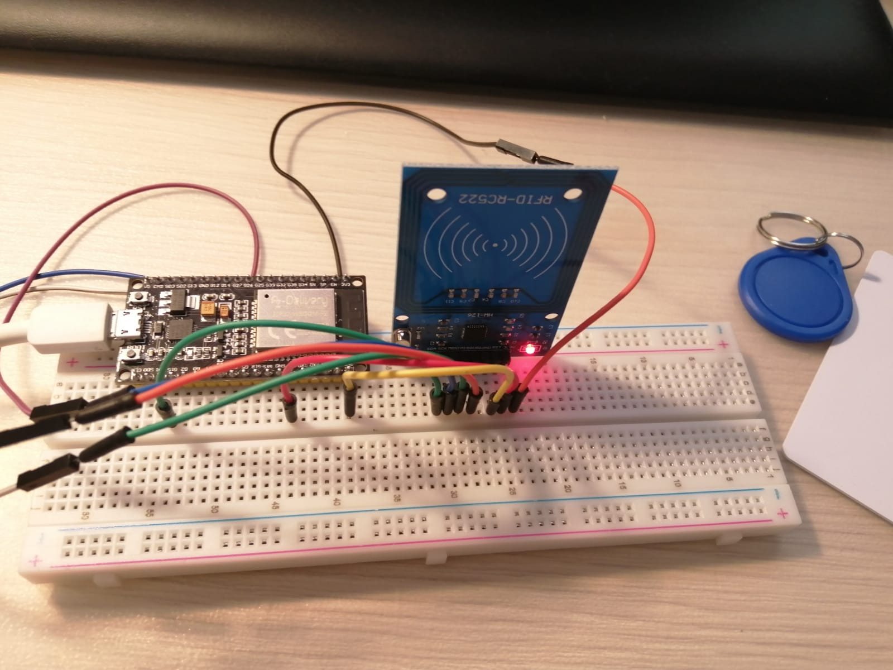
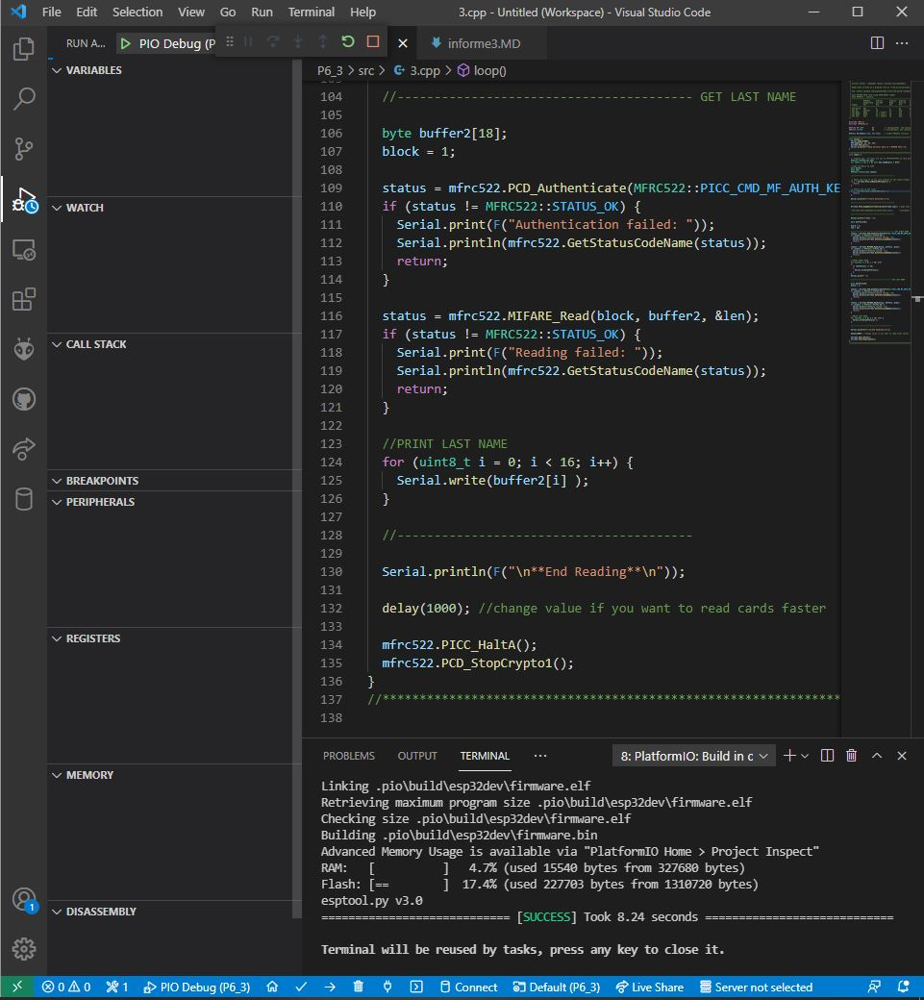
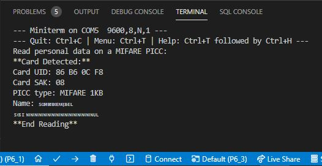
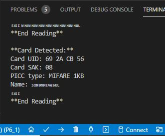

# PRACTICA 6_3  : Buses de comunicación II (SPI)

## 1.Foto del montaje



## 2.Salidas de depuración ( print... )



## 3.Código generado

```
#include <SPI.h>
#include <MFRC522.h>

#define RST_PIN         21           // Configurable, see typical pin layout above
#define SS_PIN          15          // Configurable, see typical pin layout above

MFRC522 mfrc522(SS_PIN, RST_PIN);   // Create MFRC522 instance

//*****************************************************************************************//
void setup() {
  Serial.begin(9600);                                           // Initialize serial communications with the PC
  SPI.begin(14, 12, 13, 15);                                                  // Init SPI bus
  mfrc522.PCD_Init();                                              // Init MFRC522 card
  Serial.println(F("Read personal data on a MIFARE PICC:"));    //shows in serial that it is ready to read
}

//*****************************************************************************************//
void loop() {

  // Prepare key - all keys are set to FFFFFFFFFFFFh at chip delivery from the factory.
  MFRC522::MIFARE_Key key;
  for (byte i = 0; i < 6; i++) key.keyByte[i] = 0xFF;

  //some variables we need
  byte block;
  byte len;
  MFRC522::StatusCode status;

  //-------------------------------------------

  // Reset the loop if no new card present on the sensor/reader. This saves the entire process when idle.
  if ( ! mfrc522.PICC_IsNewCardPresent()) {
    return;
  }

  // Select one of the cards
  if ( ! mfrc522.PICC_ReadCardSerial()) {
    return;
  }

  Serial.println(F("**Card Detected:**"));

  //-------------------------------------------

  mfrc522.PICC_DumpDetailsToSerial(&(mfrc522.uid)); //dump some details about the card

  //mfrc522.PICC_DumpToSerial(&(mfrc522.uid));      //uncomment this to see all blocks in hex

  //-------------------------------------------

  Serial.print(F("Name: "));

  byte buffer1[18];

  block = 4;
  len = 18;

  //------------------------------------------- GET FIRST NAME
  status = mfrc522.PCD_Authenticate(MFRC522::PICC_CMD_MF_AUTH_KEY_A, 4, &key, &(mfrc522.uid)); //line 834 of MFRC522.cpp file
  if (status != MFRC522::STATUS_OK) {
    Serial.print(F("Authentication failed: "));
    Serial.println(mfrc522.GetStatusCodeName(status));
    return;
  }

  status = mfrc522.MIFARE_Read(block, buffer1, &len);
  if (status != MFRC522::STATUS_OK) {
    Serial.print(F("Reading failed: "));
    Serial.println(mfrc522.GetStatusCodeName(status));
    return;
  }

  //PRINT FIRST NAME
  for (uint8_t i = 0; i < 16; i++)
  {
    if (buffer1[i] != 32)
    {
      Serial.write(buffer1[i]);
    }
  }
  Serial.print(" ");

  //---------------------------------------- GET LAST NAME

  byte buffer2[18];
  block = 1;

  status = mfrc522.PCD_Authenticate(MFRC522::PICC_CMD_MF_AUTH_KEY_A, 1, &key, &(mfrc522.uid)); //line 834
  if (status != MFRC522::STATUS_OK) {
    Serial.print(F("Authentication failed: "));
    Serial.println(mfrc522.GetStatusCodeName(status));
    return;
  }

  status = mfrc522.MIFARE_Read(block, buffer2, &len);
  if (status != MFRC522::STATUS_OK) {
    Serial.print(F("Reading failed: "));
    Serial.println(mfrc522.GetStatusCodeName(status));
    return;
  }

  //PRINT LAST NAME
  for (uint8_t i = 0; i < 16; i++) {
    Serial.write(buffer2[i] );
  }

  //----------------------------------------

  Serial.println(F("\n**End Reading**\n"));

  delay(1000); //change value if you want to read cards faster

  mfrc522.PICC_HaltA();
  mfrc522.PCD_StopCrypto1();
}
```
## 4.Explicación del código

En este ejercicio, se muestra una ampliación del ejercicio anterior mediante la lectura de la etiqueta UID, la etiqueta SAK, el tipo de PICC y el nombre de más de una tarjeta mediante buses de comunicación SPI.

El código comienza definiendo las variables RST_PIN y SS_PIN  que se encargaran de vincular los pines RST y SS (SDA), respectivamente. Más tarde, en la configuración, se incializa el bus SPI, codificado, en este caso, en HSPI. Así pues, se inicializa el MFRC522, es decir, el lector de tarjeta.
En cuanto al bucle, se da uso a la instrucción "mfrc522.PICC_IsNewCardPresent()" para detectar la tarjeta cuando la acercamos al lector. Si esto se consigue, se selecciona la tarjeta con la instrucción "mfrc522.PICC_ReadCardSerial()".
Una vez seleccionada, sacamos toda la información sobre la tarjeta mediante la instrucción "mfrc522.PICC_DumpDetailsToSerial(&(mfrc522.uid))" por el terminal. Para mostrar los nombres se utilitzan las variables byte, block, len y la clase MFRC522.

## 5.Salida del terminal

#### 5.1.Llavero azul



#### 5.2.Tarjeta blanca

